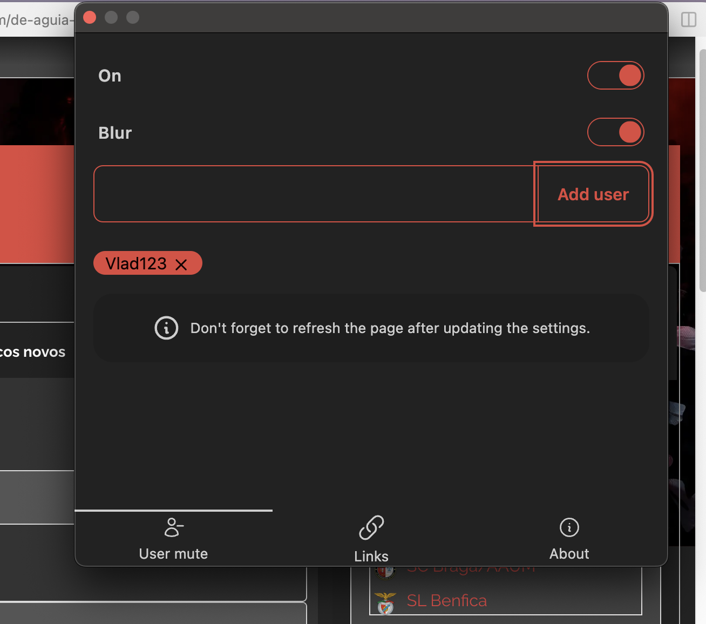

# SerBenfiquista Companion browser extension

This is a companion extension for SerBenfiquista forum. **This is not an official extension.**

## Installation guide

### Web store

[Chrome Web Store](https://chromewebstore.google.com/detail/serbenfiquista-companion/mikangdjljeaciipkiggnodlfbeegggk)

### Manual installation

1. Go to the [Releases page](https://github.com/jca41/serbenfiquista-browser-extension/releases) and select the latest one.
2. Click "Assets", download `dist.zip` and unzip the file.
3. Go to `chrome://extensions/` and enable "Developer Mode".
4. Click "Load unpacked" and select the extension folder.

__Install later updates:__ If there's an update on the code, like a bug fix, please go ahead and reinstall the extension.

## Features

### User mute

The current way of ignoring users in SB is a bit flawed as you can still see quotes from the ignored users. This extension targets the normal topic pages and best messages section. It will hide both direct and quoted messages.

For this purpose, this extension does not modify or alter the original page html. It uses CSS to hide the content instead.

## Browser Support

- Chrome
- Opera

## Privacy Policy

We do not collect or store any user identifiable information. This extensions uses the `chrome.sync` API to store the extension settings.
